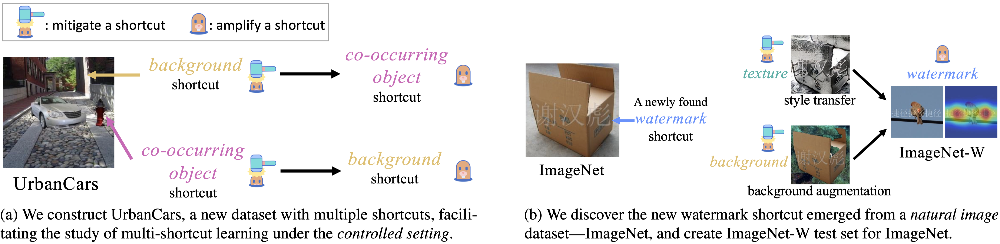

# A Whac-A-Mole Dilemma: Shortcuts Come in Multiples Where Mitigating One Amplifies Others

[Zhiheng Li](https://zhiheng.li), [Ivan Evtimov](https://ivanevtimov.eu/), [Albert Gordo](https://agordo.github.io/), [Caner Hazirbas](https://hazirbas.com/), [Tal Hassner](https://talhassner.github.io/home/), [Cristian Canton Ferrer](https://cristiancanton.github.io/), [Chenliang Xu](https://www.cs.rochester.edu/~cxu22/), [Mark Ibrahim](https://markibrahim.me/)

[[`preprint`]()]

<div align="center">
  
</div><br/>

**TL; DR**: Our benchmark results on UrbanCars and ImageNet reveal the overlooked Whac-A-Mole dilemma in shortcut mitigation, i.e., mitigating one shortcut amplifies the reliance on other shortcuts.

## ImageNet-W

We discover the new watermark shortcut in ImageNet. and create ImageNet-W test set to study (1) state-of-the-art vision models' reliance on the watermark shortcut; (2) the reliance on multiple shortcuts on ImageNet when using ImageNet-W along with other out-of-distribution variants of ImageNet (e.g., ImageNet-R).

### Use ImageNet-W

* Install ImageNet-W package:
```shell
pip install git+https://github.com/facebookresearch/Whac-A-Mole.git
```

* Use `AddWatermark` transform for ImageNet:
```python
from imagenet_w import AddWatermark
from torchvision.datasets import ImageNet

resize_size = 256
crop_size = 224

test_transform = transforms.Compose(
      [
          transforms.Resize(resize_size),
          transforms.CenterCrop(crop_size),
          transforms.ToTensor(),
          AddWatermark(crop_size),  # insert AddWatermark before normalize
          normalize,
      ]
  )

imagenet_w = ImageNet(root, split="val", transform=test_transform)
```

* * *

## Requirements

```shell
pip install -r requirements.txt
```

* * *

## UrbanCars Experiments

We construct UrbanCars dataset, a new dataset with multiple shortcuts (i.e., background and co-occurring object), facilitating the study of multi-shortcut learning under the controlled setting.

### Generate UrbanCars Dataset

```shell
bash scripts/prepare_dataset_models/create_urbancars.sh
```


### Train Shortcut Mitigation Methods on UrbanCars

Use shell scripts in `scripts/train_urbancars` to run each method, e.g.,:
```shell
bash scripts/train_urbancars/$METHOD.sh
```

where `$METHOD` should be replaced by method names listed in `scripts/train_urbancars`.


* * *

## ImageNet Experiments

### Prepare ImageNet and its out-of-distribution variants

See [prepare_ImageNet.md](create_datasets/imagenet/prepare_ImageNet.md)

### Prepare models for evaluating shortcut reliance

See [prepare_checkpoints_for_eval.md](eval_shortcuts/prepare_checkpoints_for_eval.md)

### Evaluate state-of-the-art vision models' watermark shortcut reliance
```shell
PYTHONPATH=.:$PYTHONPATH python eval_shortcuts/eval_watermark_shortcut.py
```

### Evaluate reliance on multiple shortcuts

```shell
PYTHONPATH=.:$PYTHONPATH python eval_shortcuts/eval_multiple_shortcuts.py
```

### Training

We use [last layer retraining](https://arxiv.org/abs/2204.02937) for ImageNet experiments.

```shell
PYTHONPATH=.:$PYTHONPATH python imagenet_trainers/launcher.py --method ${METHOD} --amp --feature_extractor resnet50_erm --lr ${LR} [--wandb] [--slurm_partition ${SLURM_PARTITION}] [--slurm_job_name ${METHOD}_imagenet]
```

* `${METHOD}` is the method name (check options for `--method` by `PYTHONPATH=.:$PYTHONPATH python imagenet_trainers/launcher.py --help`).

* [Optional] Use `--slurm_partition ${SLURM_PARTITION}` and `--slurm_job_name ${METHOD}_imagenet` when training on a [Slurm](https://slurm.schedmd.com/documentation.html) cluster, where we use [submitit](https://github.com/facebookincubator/submitit) to submit jobs.

* [Optional] Turn on `--wandb` to use [wandb](https://wandb.ai) for logging.

* `--feature_extractor resnet50_erm` means using ResNet-50 trained with ERM to as the feature extractor. For our porposed Last Layer Ensemble (LLE) method, we also use  `vit-b_mae-ft`, `vit-l_mae-ft`, `vit-h_mae-ft` (ViT architecture with finetuned [MAE](https://github.com/facebookresearch/mae)) , and `vit-b_swag-ft` (ViT-B architecture with finetuned [SWAG](https://github.com/facebookresearch/SWAG)).

* `${LR}` is the learning rate. We tune learning rates based on IN-1k top-1 accuracy. The learning rates after tuning and the checkpoints are shown in the following table:

| method            | architecture | IN-1k | IN-W Gap  | Carton Gap | SIN Gap    | IN-R Gap   | IN-9 Gap  | LR   | download |
|-------------------|--------------|-------|-----------|------------|------------|------------|-----------|------|------------|
| ERM               | ResNet-50    | 76.39 | -25.40    | +30        | -69.43     | -56.22     | -5.19     | 1e-3 | [model](https://dl.fbaipublicfiles.com/whac_a_mole/llr/erm.pth) |
| Mixup             | ResNet-50    | 76.17 | -24.87    | +34        | -68.18     | -55.79     | -5.60     | 1e-4 | [model](https://dl.fbaipublicfiles.com/whac_a_mole/llr/mixup.pth) |
| CutMix            | ResNet-50    | 75.90 | -25.78    | +32        | -69.31     | -56.36     | -5.65     | 1e-4 | [model](https://dl.fbaipublicfiles.com/whac_a_mole/llr/cutmix.pth) |
| Cutout            | ResNet-50    | 76.40 | -25.11    | +32        | -69.39     | -55.93     | -5.35     | 1e-3 | [model](https://dl.fbaipublicfiles.com/whac_a_mole/llr/cutout.pth) |
| AugMix            | ResNet-50    | 76.23 | -23.41    | +38        | -68.51     | -54.91     | -5.85     | 1e-4 | [model](https://dl.fbaipublicfiles.com/whac_a_mole/llr/augmix.pth) |
| SD                | ResNet-50    | 76.39 | -26.03    | +30        | -69.42     | -56.36     | -5.33     | 1e-3 | [model](https://dl.fbaipublicfiles.com/whac_a_mole/llr/sd.pth) |
| WTM Aug           | ResNet-50    | 76.32 | **-5.78** | +14        | -69.31     | -56.22     | -5.34     | 1e-3 | [model](https://dl.fbaipublicfiles.com/whac_a_mole/llr/wtm_aug.pth) |
| TXT Aug           | ResNet-50    | 75.94 | -25.93    | +36        | -63.99     | **-53.24** | -5.66     | 1e-4 | [model](https://dl.fbaipublicfiles.com/whac_a_mole/llr/txt_aug.pth) |
| BG Aug            | ResNet-50    | 76.03 | -25.01    | +36        | -68.41     | -54.51     | -4.67     | 1e-4 | [model](https://dl.fbaipublicfiles.com/whac_a_mole/llr/bg_aug.pth) |
| LfF               | ResNet-50    | 76.35 | -26.19    | +36        | -69.34     | -56.02     | -5.61     | 1e-4 | [model](https://dl.fbaipublicfiles.com/whac_a_mole/llr/lff.pth) |
| JTT               | ResNet-50    | 76.33 | -26.40    | +32        | -69.48     | -56.30     | -5.55     | 1e-2 | [model](https://dl.fbaipublicfiles.com/whac_a_mole/llr/jtt.pth) |
| EIIL              | ResNet-50    | 71.51 | -33.17    | +24        | -65.93     | -61.09     | -6.27     | 1e-4 | [model](https://dl.fbaipublicfiles.com/whac_a_mole/llr/eiil.pth) |
| DebiAN            | ResNet-50    | 76.33 | -26.40    | +36        | -69.37     | -56.29     | -5.53     | 1e-4 | [model](https://dl.fbaipublicfiles.com/whac_a_mole/llr/debian.pth) |
| **LLE (ours)**        | ResNet-50    | 76.25 | -6.18     | **+10**    | **-61.00** | -54.89     | **-3.82** | 1e-3 | [model](https://dl.fbaipublicfiles.com/whac_a_mole/llr/lle_r50.pth) |
|                   |              |       |           |            |            |            |           |      |            |
| MAE + **LLE (ours)**  | ViT-B        | 83.68 | -2.48     | +6         | -58.78     | -44.96     | -3.70     | 1e-3 | [model](https://dl.fbaipublicfiles.com/whac_a_mole/llr/lle_vit-b_mae-ft.pth) |
| MAE + **LLE (ours)**  | ViT-L        | 85.84 | -1.74     | +12        | -56.32     | -34.64     | -2.77     | 1e-3 | [model](https://dl.fbaipublicfiles.com/whac_a_mole/llr/lle_vit-l_mae-ft.pth) |
| MAE + **LLE (ours)**  | ViT-H        | 86.84 | -1.11     | +28        | -55.69     | -30.95     | -2.35     | 1e-3 | [model](https://dl.fbaipublicfiles.com/whac_a_mole/llr/lle_vit-h_mae-ft.pth) |
| SWAG + **LLE (ours)** | ViT-B        | 85.37 | -2.50     | +8         | -60.92     | -28.37     | -3.19     | 1e-4 | [model](https://dl.fbaipublicfiles.com/whac_a_mole/llr/lle_vit-b_swag-ft.pth) |


In our proposed Last Layer Ensemble (LLE) method, we also use edge detection for data augmentation, i.e., Edge Aug. The details of how to generate edge detection data on ImageNet and the checkpoints are in [Edge_Aug.md](create_datasets/imagenet/Edge_Aug.md).

### Evaluation

To evaluate the trained models, download the checkpoint from the table above and use its file path as `${PATH_TO_CHECKPOINT}`:
```shell
PYTHONPATH=.:$PYTHONPATH python imagenet_trainers/launcher.py --method ${METHOD} --amp --feature_extractor resnet50_erm [--wandb] [--slurm_partition ${SLURM_PARTITION}] [--slurm_job_name ${METHOD}_imagenet] --evaluate --resume ${PATH_TO_CHECKPOINT}
```

## <a name="CitingWhacAMole"></a>Citation

If you use UrbanCars dataset or ImageNet-W dataset, or compare with our proposed Last Layer Ensemble (LLE) method, please cite our paper:

```BibTeX
@article{li_2022_whac_a_mole,
  title={A Whac-A-Mole Dilemma: Shortcuts Come in Multiples Where Mitigating One Amplifies Others},
  author={Zhiheng Li and Ivan Evtimov and Albert Gordo and Caner Hazirbas and Tal Hassner and Cristian Canton Ferrer and Chenliang Xu and Mark Ibrahim},
  journal={arXiv},
  year={2022}
}
```

## License

See [LICENSE](LICENSE) for details.


## Attribution
<a href="https://www.flaticon.com/free-icons/whack-a-mole" title="whack a mole icons">The Whack-A-Mole icon is created by Flat Icons - Flaticon</a>
